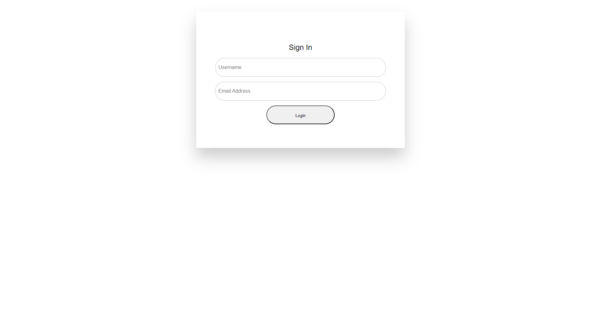

# Project Repository

Welcome to the repository for our project! This repository contains the necessary assets to showcase our project, including a screenshot and a live link.

## Project Overview
Our project aims to [briefly describe the purpose or goal of your project]. It [provide a high-level summary of your project's features, functionality, or benefits]. This README will guide you on how to access the project's live demonstration and view its screenshot.

## Screenshot

Above is a screenshot of our project's user interface, providing you with a visual preview of what the project looks like.

## Live Demo
To interact with the project, you can access the live demo by clicking the link below:

[**Project Live Demo**](http://harisdev.me/jubilant-guide/)

Feel free to explore the project and experience its features firsthand. We appreciate any feedback or suggestions you might have!