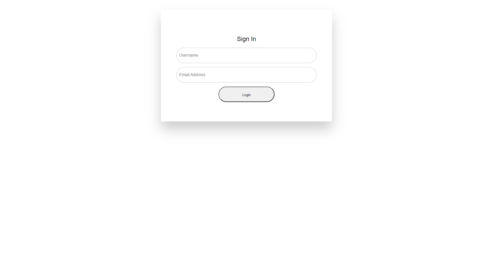

# Project README

## Project Screenshot

## About

This README.md file contains a screenshot of the created project. Due to the presence of multiple projects within this repository, it's not feasible to deploy it on platforms like GitHub Pages or Netlify. Therefore, a screenshot has been provided above to showcase the appearance and essence of the project.

Please note that this is a static representation, and for a more interactive experience, it's recommended to clone and run the project locally on your machine. Refer to individual project directories for specific instructions on running each project.

## Contact

For any inquiries or further details about the projects, feel free to reach out to the project contributors. Thank you for your understanding!